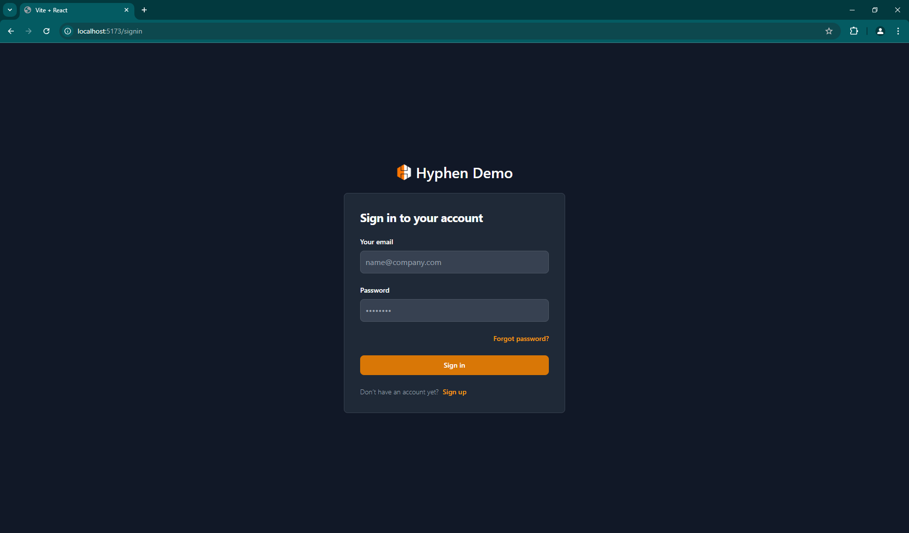
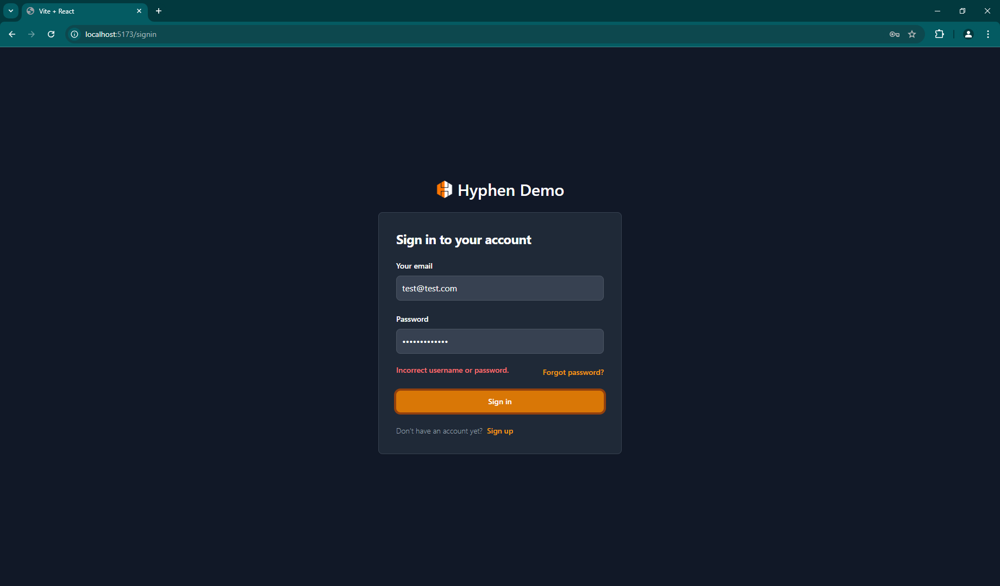
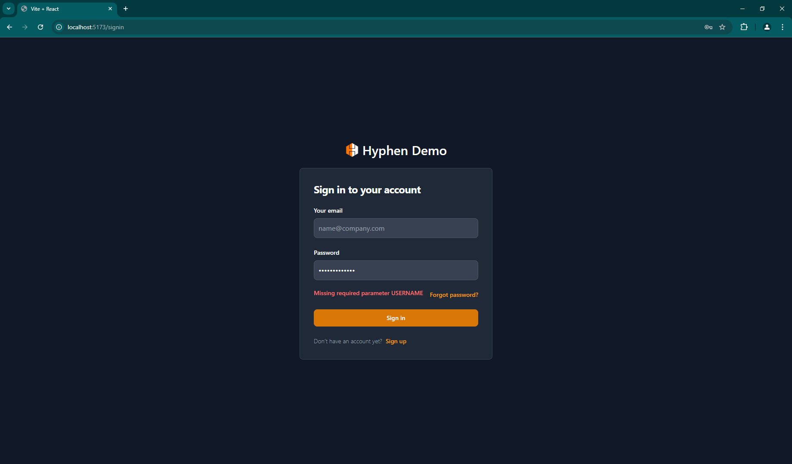
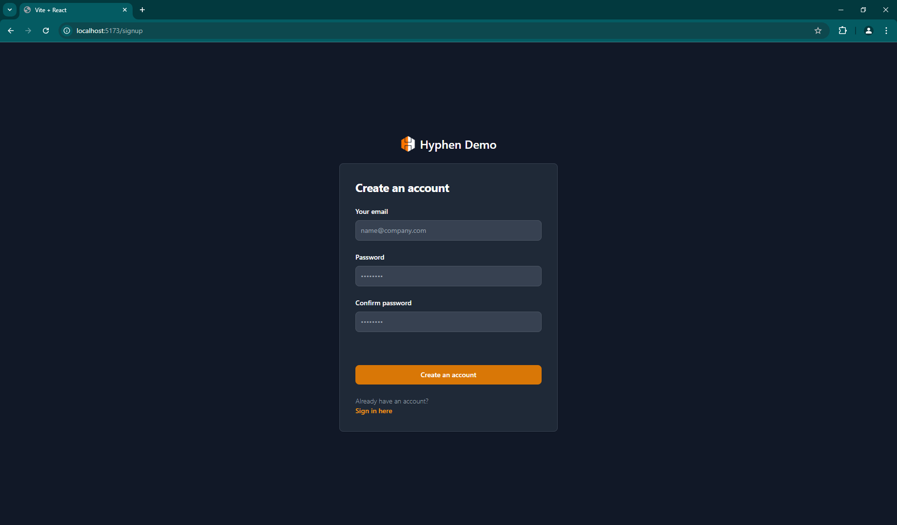
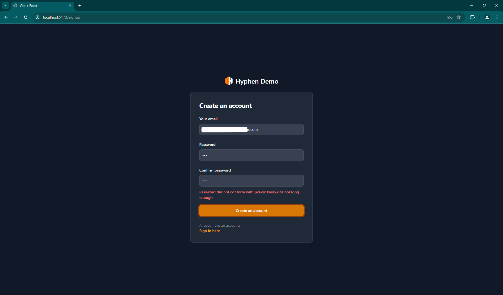
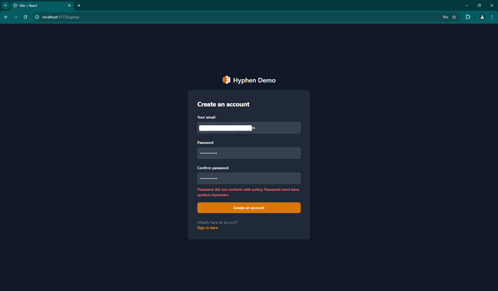
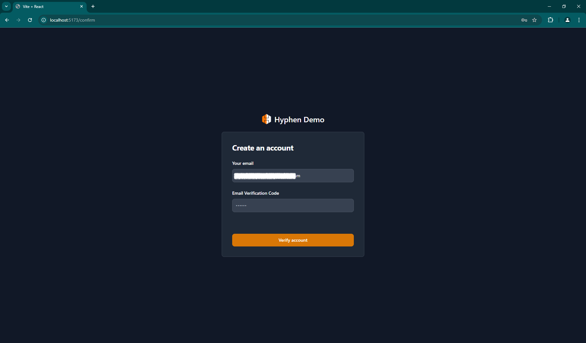
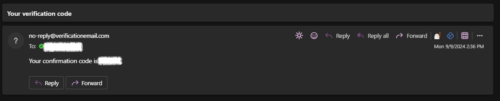
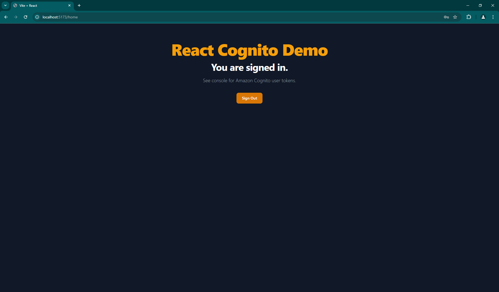
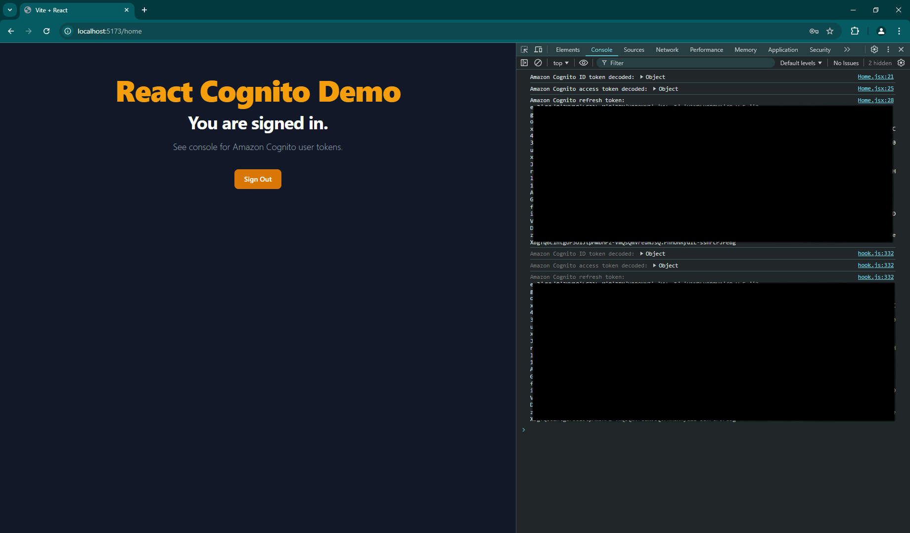

# React + Query + Tailwind + Wouter Demo

#### Vite React app using:
- TanStack Query (React Query)
- Wouter (lighter and simpler version of react-router)
- Tailwind CSS (with styles taken and modified from Flowbite)
- Vitest (equivalent of Jest for Vite)

## Installation

Install dependencies
```bash
pnpm install
```
Create a `.env` file in the root directory and add the following cognito credentials:
```bash
# Auth API URL
VITE_AUTH_API=***************
```

## Development
Run the application
```bash
pnpm dev
```

## Testing

To run the tests once
```bash
pnpm test
```
To run the tests in watch mode
```bash
pnpm test:watch
```
To run the tests in watch mode with UI
```bash
pnpm test:ui
```

## Screenshots

### Sign In Page


### Sign In Page - User & Password errors



### Reset Password Page
- In Construction

### Sign Up Page


### Sign Up Page - Password policy errors





### Sign Up Confirmation Page


### Emailed Code


### Signed In Home Page


